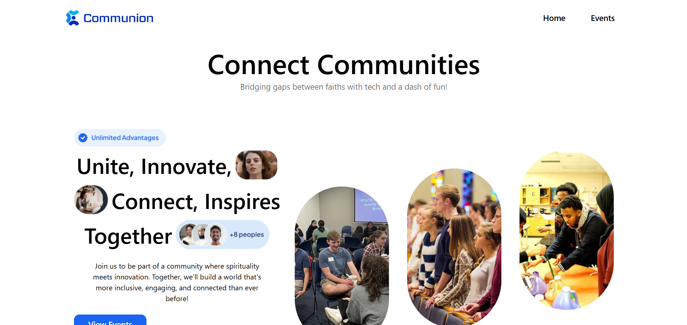
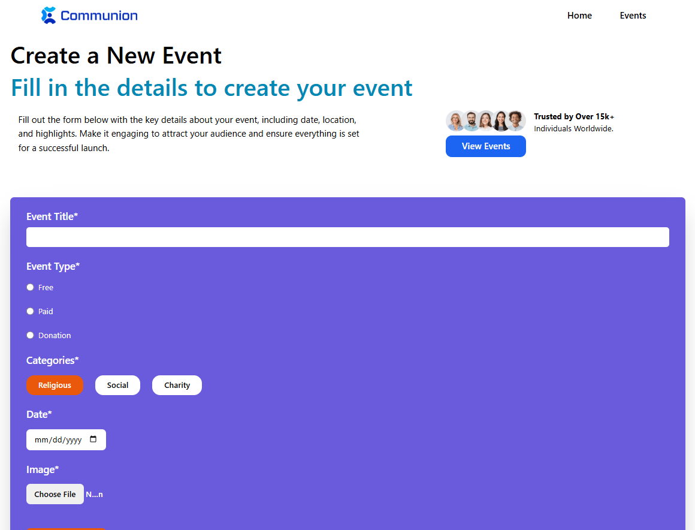

🎉 Event Management App 🎟️

📌 Description

This is a fully responsive and interactive Event Management Application built with React.js and Tailwind CSS. The app provides a seamless user experience across different screen sizes. It consists of three main pages:

🏠 Home Page - Serves as the landing page with an introduction to the application.

📅 Event Page - Displays all the created events for users to browse.

✍️ Create Event Page - Allows users to create new events that will be displayed on the event page.

Users can easily create events and view them dynamically in the event section.

🚀 Features

⚛️ Built with React.js and styled using Tailwind CSS.

📱 Fully responsive design for all screen sizes.

🎨 Interactive UI with smooth transitions.

📝 Event Creation: Users can create new events.

📌 Event Listing: View all events in a structured layout.

🏗️ Technologies Used

⚛️ React.js for building the UI

🎨 Tailwind CSS for styling

🚏 React Router for navigation

## 🖼️ Screenshots

### 🏠 Home Page

### 📅 Event Page

### ✍️ Create Event Page

